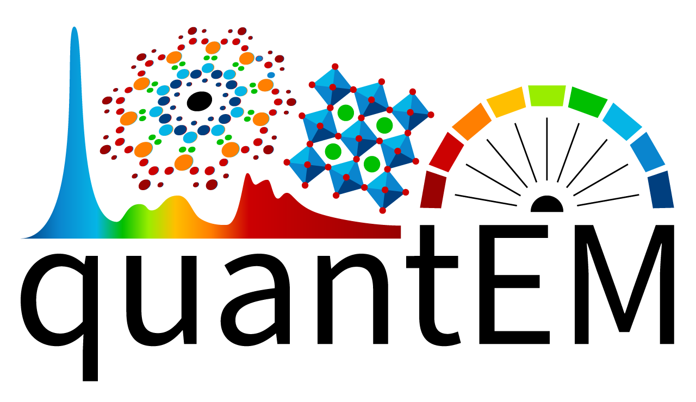

# quantem

[](https://pypi.org/project/quantem/)
[](LICENSE)
[](https://doi.org/10.5281/zenodo.18642593)

``quantem`` is a quantitative electron microscopy data analysis toolkit built on [PyTorch](https://pytorch.org/). It brings together tools for reconstructing or analyzing a wide range of transmission electron microscopy (TEM) techniques, including nanobeam diffraction, phase retrieval, real-space imaging and tomography, spectroscopy, and related analyses within a consistent, GPU-accelerated API.

## Capabilities

- **Ptychographic phase retrieval**: ML-enabled iterative reconstruction ([McCray et al., 2025](https://arxiv.org/abs/2511.07795)) and direct methods ([Varnavides et al., 2026](https://doi.org/10.1093/mam/ozaf139)).
- **Tomography**: fast and accurate HAADF tomography using implicit representations ([Lim et al., 2025](https://arxiv.org/abs/2512.08113)).
- **Imaging**: drift correction and lattice analysis for (S)TEM images.
- **Data structures & I/O**: a unified `Dataset` hierarchy that reads common electron-microscopy formats and serializes to [Zarr](https://zarr.dev/).
- **Visualization**: publication-quality figures with perceptually-uniform colormaps; for interactive, GPU-accelerated visualization, see the companion [quantem.widget](https://github.com/electronmicroscopy/quantem.widget) repository.
- **GPU-accelerated & ML-ready**: a PyTorch backend with neural object representations and multi-GPU / multi-node reconstruction.
- **Spectroscopy**: GPU-accelerated spectra fitting for EDS and EELS, under development.
- **Diffraction**: multi-angle precession electron diffraction (MAPED), under development ([Ribet et al., 2025](https://doi.org/10.1093/mam/ozaf103)).

## Installation

quantem is available on the [Python Package Index](https://pypi.org/project/quantem/) and requires Python 3.11+:

```bash
pip install quantem
```

This installs PyTorch as a dependency. For CUDA-specific PyTorch builds, follow the [official PyTorch install guide](https://pytorch.org/get-started/locally/) for your platform first.

To install from source or set up a development environment, see [CONTRIBUTING.md](CONTRIBUTING.md). A local install can also be used to access the newest development features of individual modules that exist on feature branches prior to PRs. 

### GPU acceleration

For custom CUDA kernels that accelerate tomography, ptychography, and io behind a torch-native API, see the companion [quantem-cuda](https://github.com/electronmicroscopy/quantem-cuda) package (optional, more coming soon).

## Getting started

The [quantem-tutorials](https://github.com/electronmicroscopy/quantem-tutorials) repository contains Jupyter notebooks that walk through the main workflows for each module.

For interactive visualization in notebooks, command-line workflows, standalone HTML exports, and browser WebGPU, see [quantem.widget](https://github.com/electronmicroscopy/quantem.widget). Its [documentation](https://electronmicroscopy.github.io/quantem.widget/) covers installation, tutorials, supported backends, and complete visualization workflows.

## Citing

If you use quantem in your research, please cite this repository as well as the relevant paper(s) for any module(s) that you used:

- **quantem (software)**: please cite the version you used. Ready to use citations can be copied from the [Zenodo record](https://doi.org/10.5281/zenodo.18642593), or from the "Cite this repository" button on [GitHub](https://github.com/electronmicroscopy/quantem).

- **Iterative ptychography**: McCray, A. R. C., Ribet, S. M., Varnavides, G., & Ophus, C. (2025). *Deep generative priors for robust and efficient electron ptychography.* arXiv:2511.07795. https://arxiv.org/abs/2511.07795
- **Direct ptychography**: Varnavides, G., Bekkevold, J. M., Ribet, S. M., Scott, M. C., Jones, L., & Ophus, C. (2026). *Relaxing Direct Ptychography Sampling Requirements via Parallax Imaging Insights.* Microscopy and Microanalysis, 32(2), ozaf139. https://doi.org/10.1093/mam/ozaf139
- **Electron tomography (implicit neural representations)**: Lim, C., Casert, C., McCray, A. R. C., Lee, S., Barnum, A., Dionne, J., & Ophus, C. (2025). *Missing Wedge Inpainting and Joint Alignment in Electron Tomography through Implicit Neural Representations.* arXiv:2512.08113. https://arxiv.org/abs/2512.08113
- **Multi-angle precession electron diffraction (MAPED)**: Ribet, S. M., Dhall, R., Ophus, C., & Bustillo, K. C. (2025). *Multi-angle Precession Electron Diffraction (MAPED): A Versatile Approach to 4D-STEM Precession.* Microscopy and Microanalysis, 31(6), ozaf103. https://doi.org/10.1093/mam/ozaf103
- **quantEM interactive visualization framework**: Lee, S., et al. (2026). *Interactive Framework for Real-Time 4DSTEM Analysis and Reconstruction.* Microscopy and Microanalysis, 32(Supplement 1), ozag053.941. https://doi.org/10.1093/mam/ozag053.941


## Contributing

Contributions are welcome! See [CONTRIBUTING.md](CONTRIBUTING.md) for the development setup and workflow, and [CONTRIBUTORS.md](CONTRIBUTORS.md) for the people who have built quantem.

## License

quantem is free and open source software, distributed under the [MIT License](LICENSE).
